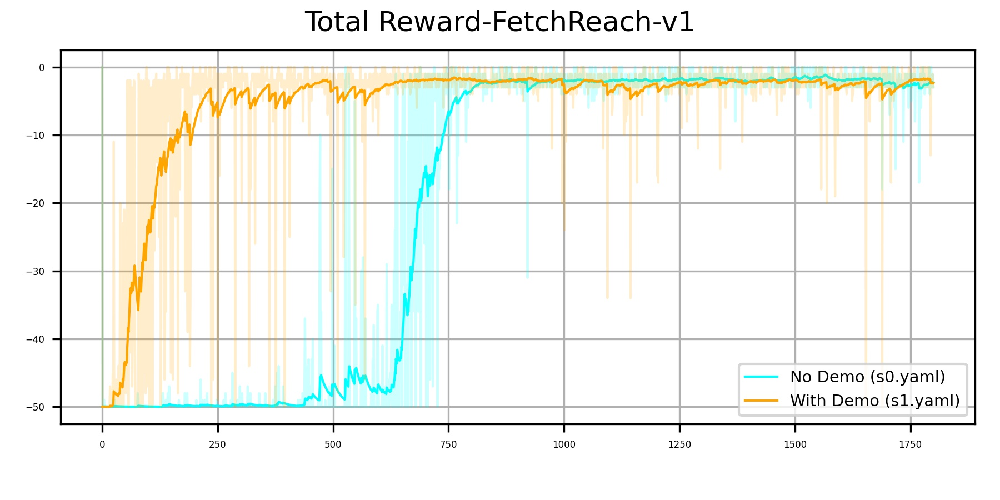

# DDPG from Demonstration

## Introduction

This project implements the DDPG from Demonstration algorithm (DDPGfD, \[1\]) on a simple control task. 

The DDPGfD algorithm suggests the following settings for improvement:

1. Always keep the demonstration data in the replay buffer and assign them with high priority. Specifically, priority for a transition tuple $(s_t,a_t,G_{t:t+n},s_{t+n+1},\gamma^{n+1})_i$ is

   $p_{i}=\delta_{i}^{2}+\lambda\left|\nabla_{a} Q\left(s_{i}, a_{i} \mid \theta^{Q}\right)\right|^{2}+\epsilon+\epsilon_{D}$, where

   $\delta_i$: last TD error

   $|\nabla_{a} Q(s_{i}, a_{i} |  \theta^{Q})|^{2}$: actor loss

   $\epsilon$: small constant (0.001)

   $\epsilon_D$:  large demonstration priority constant (0.99)

   $\lambda$: balancing factor

2. Mix of 1-step and $N$-step return in the replay buffer for updating the critic function

   $R_{n}=\sum_{i=0}^{n-1} \gamma^{i} r_{i}+\gamma^{n} Q\left(s_{n-1}^{\prime}, \pi\left(s_{n-1}^{\prime}\right) ; \theta^{Q^{\prime}}\right)$

   $L_{n}\left(\theta^{Q}\right)=\frac{1}{2}\left(R_{n}-Q\left(s, \pi(s) \mid \theta^{Q}\right)\right)^{2}$

3. Pre-training the critic using the demonstration data

4. Multiple learning update per environment step

5. L2 Regularization (weight decay) on actor and critic networks

## Implementation details and hyper-parameters

We use the environment **FetchReach-v1**​ from openai gym. You can modify the models for other environments. All the hyper-parameters are shown in the configuration file under the config folder. Some important parameters are listed below.

### Model for actor and critic:

- Two hidden linear layers with size 512.
- Tanh as the activation function for the last layer of the actor.

### Learning

- Const learning rate: $5\times10^{-4}$
- Weight decay: $1\times10^{-5}$ 
- Training episodes: 1800
- Batch size: 4096 (sample size from replay buffer)
- Update step: 5 (at each environment step)
- Soft update: $\tau=0.3$ (ratio of the behavior network)
- $N$-step: $N=10$
- $\gamma=0.9$
- Replay buffer: size=$10^5$

### Demonstration (config/s1.yaml):

- 100 trajectories from a learned policy trained with 1800 episodes.
- Pre-train 10000 steps on the critic.


## How to run

We provide all the weight files and training configurations used in this project. You can simply jump to Step4 to check the learned policy with demonstration.

#### Step1: Learning from scratch

  ```
python train.py config/s0.yaml
  ```

#### Step2: Record demonstration data after training from step1

Modify the line 9 of **config/s0.yaml**

  ```yaml
restore: true # Restore for training or evaluation
  ```
then run
  ```
python train.py config/s0.yaml --collect 
  ```
You can also specify the specific number of trajectories you'd like to collect. E.g.,

  ```
python train.py config/s0.yaml --collect -n_collect 200
  ```

#### Step3: Learning with demonstration data

Modify the lines 47-48 of **config/s1.yaml**

   ```yaml
demo_config:
  load_demo_data: true
  demo_dir: './data/demo'
  demo_N: 100 # fill in the number of trajectories you collect
  load_N: 100  # fill in the number of trajectories you want to load
   ```
then run
   ```
python train.py config/s1.yaml
   ```

You can manually modify the number of pre-training steps in the line 18 of **s1.yaml**

   ```yaml
pretrain_step: 10000
   ```

#### Step4: Visual evaluation

Make sure the **restore** flag in the line 9 of your config (E.g., config/s1.yaml) is set to **true**.

  ```yaml
restore: true # Restore for training or evaluation
  ```
then run
  ```
python train.py config/s1.yaml --eval
  ```

## Demonstration data

We provide the demonstration data in the **data** folder with 100 trajectories. These trajectories were collected from the learned policy using **s0.yaml**.

## Result

The code for analysis is included in **train.py** for **FetchReach-v1** environment.



# Authors

- Chun-Yu Chai: cychai.cs06g@nctu.edu.tw
- Yu-En Liu
- Keng-Fu Hsu

# Reference

\[1\] Vecerik, Mel, et al. "Leveraging demonstrations for deep reinforcement learning on robotics problems with sparse rewards." *arXiv preprint arXiv:1707.08817* (2017).

\[2\] Hester, Todd, et al. "Deep q-learning from demonstrations." *Thirty-Second AAAI Conference on Artificial Intelligence*. 2018.